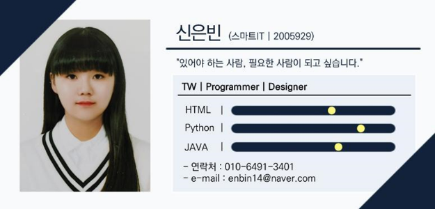
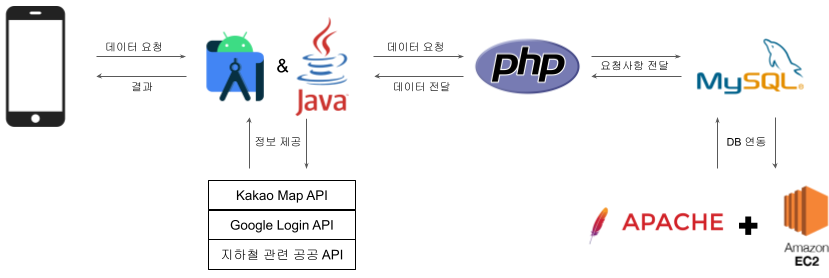
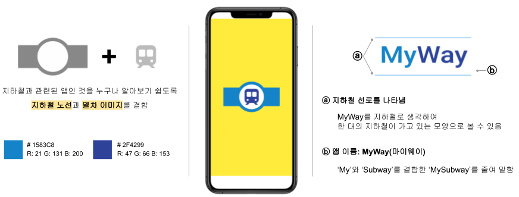
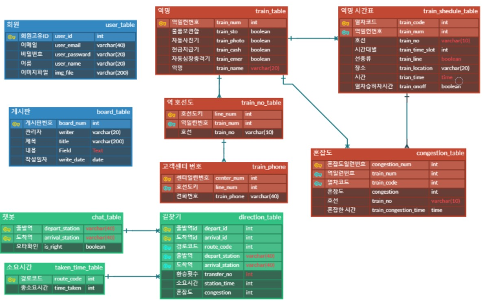

# 캡스톤 디자인 졸업작품: MyWay

### 팀원 소개와 역할분담
<table border="1">
	<th>성명</th>
	<th>PM</th>
	<th >프로그래머</th>
	<th>디자이너</th>
	<th>TW</th>
	<th>소프트웨어 관리자</th>
	<tr>
	    <td>김지연</td>
	    <td align = "center">●</td>
	    <td align = "center">●</td>
      <td></td>
      <td></td>
      <td></td>
	</tr>
  	<tr>
	    <td>신은빈</td>
	    <td></td>
	    <td align = "center">●</td>
      <td align = "center">●</td>
      <td align = "center">●</td>
      <td></td>
	</tr>
  <tr>
	    <td>오유진</td>
	    <td></td>
	    <td align = "center">●</td>
      <td></td>
      <td></td>
      <td align = "center">●</td>
	</tr>
  <tr>
	    <td>윤혜린</td>
	    <td></td>
	    <td align = "center">●</td>
      <td></td>
      <td></td>
      <td align = "center">●</td>
	</tr>
  <tr>
	    <td>조은채</td>
	    <td></td>
	    <td align = "center">●</td>
      <td align = "center">●</td>
      <td></td>
      <td></td>
	</tr>
</table>
    
### 기여도
 
<b>TW</b>
- 발표 PPT 및 회의록 작성

<b>Design</b>
- 전반적 UI 디자인

<b>Programming</b>
- 전반적 UI 구현
- 기본적 기능 구현: 스플래시, 메인홈
- Kakao Map API 연동
- 지하철 실시간 정보 Open API 연동 및 파싱

### 작품 개념
- 비즈니스 모델 캔버스

### 주제 소개와 개발 필요성
- <b>주제</b> 
공공 데이터와 다양한 API, 챗봇이라는 메커니즘을 활용하여 <b>혼잡도를 고려한 길찾기 기능을 제공해주는 어플</b>

- <b>개발 필요성</b> 
코로나19 사태가 지속되는 상황에서 대부분의 지역에서 정상 등교가 이루어지고 유동 인구가 증가함에 따라 대중교통 지하철에도 인파가 몰리며 타인과의 접촉을 피할 수 없게 됨 
→ 혼잡도를 계산하여 유동인구가 적은 경로를 찾아 지하철을 이용할 때 <b>타인과의 접촉을 최소화</b>할 수 있게 하는 어플을 제작하고자 함

### 개발 환경

### 개발(사용) 기술

### 개발 기간

### MyWay

### 화면 설계 산출물(최종 UI/UX)

### DB 설계(ER-Diagram)

### 개발 산출물(데모 영상)
https://drive.google.com/file/d/1rMIYr0twJ83Tt1STkSI_xzi7o3y8NSlO/view?usp=share_link

### 깃허브 링크와 완성물 접근 경로 및 실행 방법
- Github 원본 코드 저장소 
https://github.com/sally001020/Myway.git

- 완성물 접근 경로 및 실행 방법 
아직 Google Play 스토어에 등록 전으로 Android Studio 환경에서 Github의 프로젝트를 clone하여 실행
Google Play 스토어에 등록시 앱을 다운받아 실행 가능
